# 0.Setup
The project is configured to API level 24.
* compileSdkVersion=24
* buildToolsVersion=24.0.0
* minSdkVersion=21
* targetSdkVersion=24

# 1.Start Quiz

    

This page is the launcher activity of **Quizer** where I present 
my **name** and **university number**. And a button is provided to 
start the **Quiz Activity**. Once we start quiz, we **would not** 
be able to return this page.

# 2.Quiz Activity

    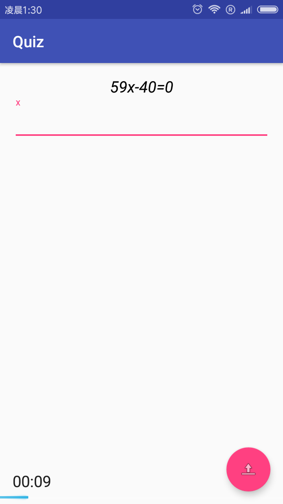
    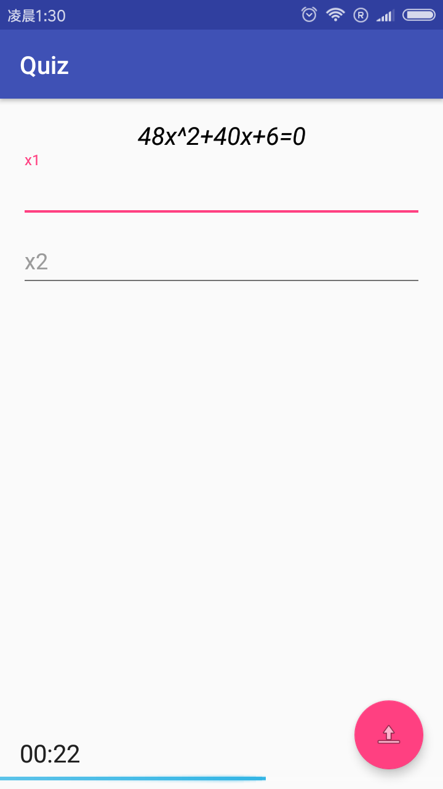

The **Quiz Activity** contains a **View Pager** to coordinate
fragments. This Activity will create a fragment for every 
question. As you can see, in every **Question Fragment**, the
equation is displayed in the top, and the number of answer box
would adjust according to the number of root of question.
* User could drag fragments to switch the questions.
A **Progress Bar** in bottom indicates current position. 
* A **Floating Action Button** is used to submit answer. Once all
questions is submitted, this button would start **Summary Activity**.
* A **Timer** is instantiated in the left bottom of page, which 
would present the time spent in whole quiz.

# 3.Question Generator
I design a abstract class **Question** to generalize all behavior of 
questions. Two implementation, of course, **Linear Question** and
**Quadratic Question** is responsible for specif logic respectively.
Every implementation has its own generator, which generate the 
parameter one by one and validate them. 
* If the generated question has no root, it would roll the dice again. 
* All parameter is generated by a random number range from 0 to 198 
and minus 99.

# 4.Calculate Answers
Since all equations is validated, it's easy to calculate answers.
* For linear question, x=-B/A
* For quadratic question, x1=(-B-sqrt(B\*B-4\*B\*C))/2A,x2=(-B+sqrt(B\*B-4\*B\*C))/2A.

# 5.Display Questions
The section 2 has shown the result. As I mentioned above, I generalized
all behavior of questions. Thus, for every fragment, I invoke **.getQuestion()**
from **Question** object. This method would return a string, that could be
displayed in the **TextView**. 

But there is a thing needed to handle. For non-negative number, I need to 
append **plus symbol** between two term. But for negative number, what I
need to do is just append the number itself. 

# 6.Number Validation

    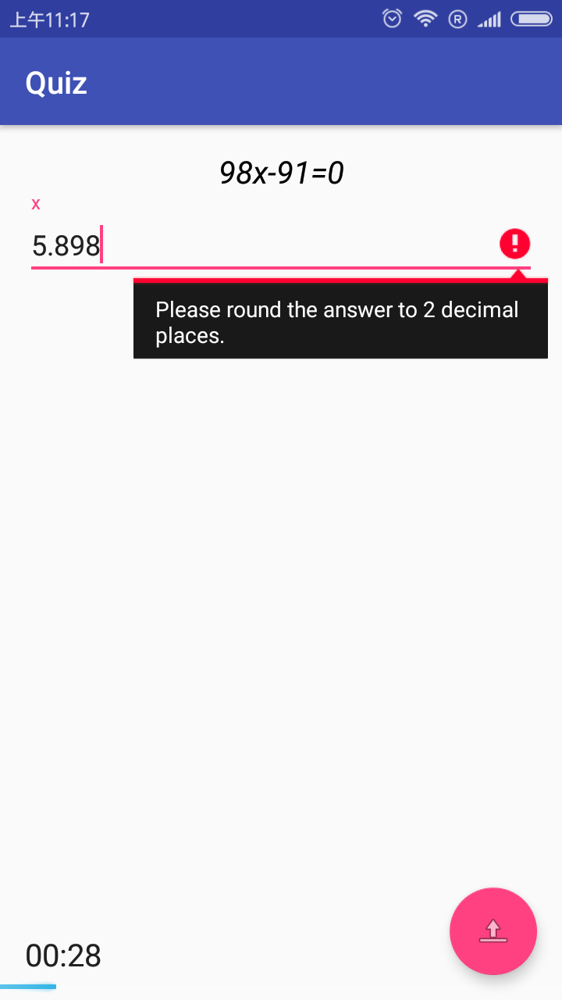
    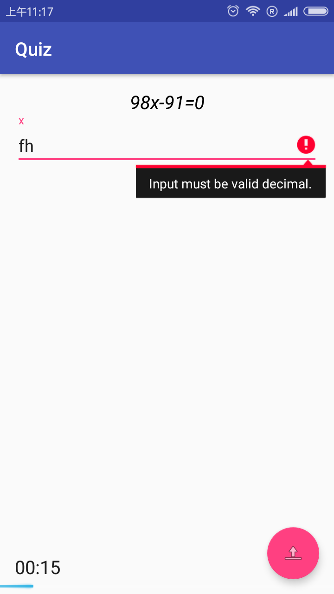

Once the user click the **Submit Button**, the app would validate before
actual submission. The validation is accomplished in two steps:
* Use **Double.parseDouble()** and try-catch block to validate whether
it's a valid decimal number. 
* Then, invoke **.indexOf('.')** from content string, to find out the 
index of decimal point. Then check whether the number of fraction 
digits is less than or equal to 2 by compare it with length of content.

The app would pop up specific warning for both step to advice user adjust
their answers.

# 7.Compare Answers.
Since the app guarantee that all input answer must round to two decimal places,
I also round the correct answer to two decimal places at very first. Then
I apply the compare logic mentioned in the assignment document to avoid 
floating accuracy error.

    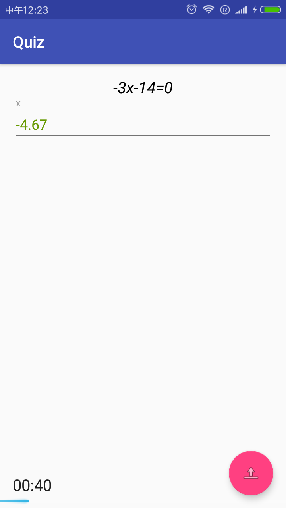
    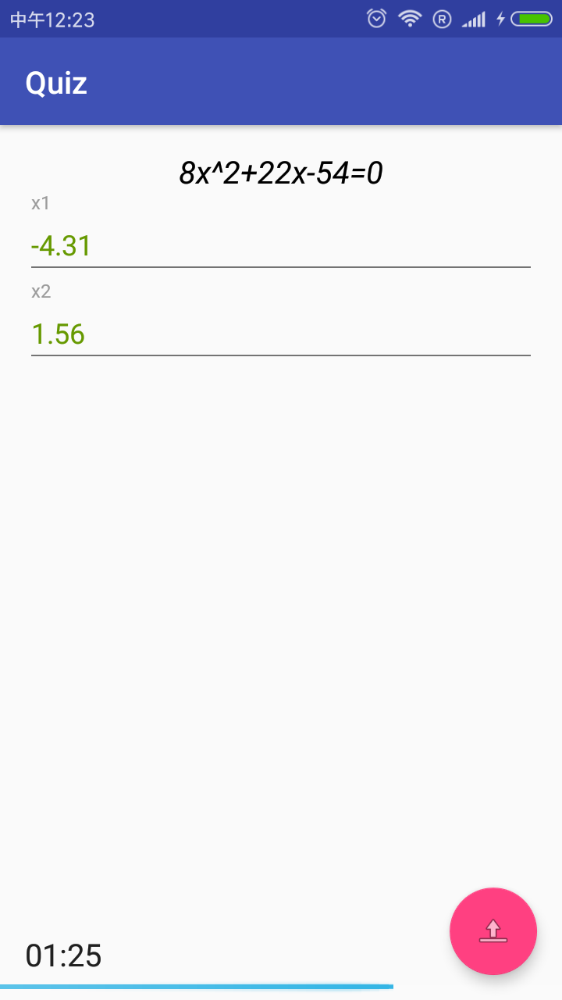

When we input correct answer and click **Submit Button**, the app would convert
the color of answer into green.

    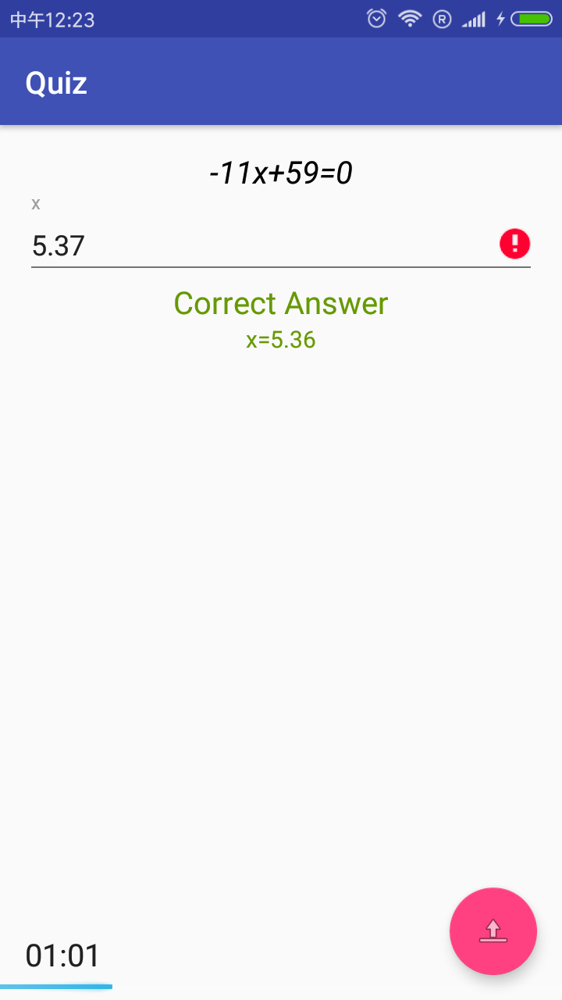
    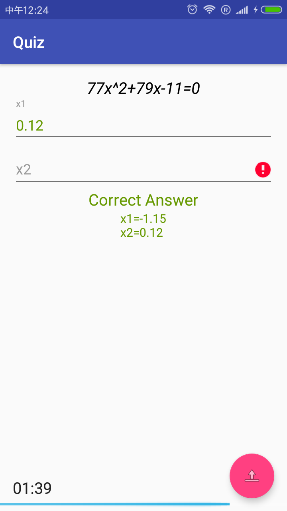

If user's answer is wrong, the app would put a exclamation beside the answer and 
display the correct answer.

# 8.Quiz Flow
* User could drag the page to choose question to answer.

    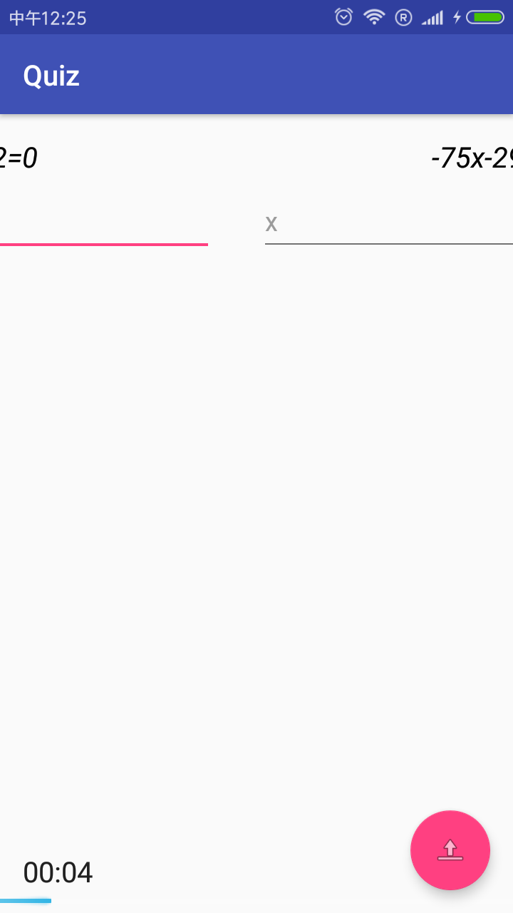

* Once all questions are submitted, user could click **Submit Button** again to 
enter the **Summary Activity**. However, if there are some questions passed, 
the app would switch to that page automatically and prompt a remind message.

    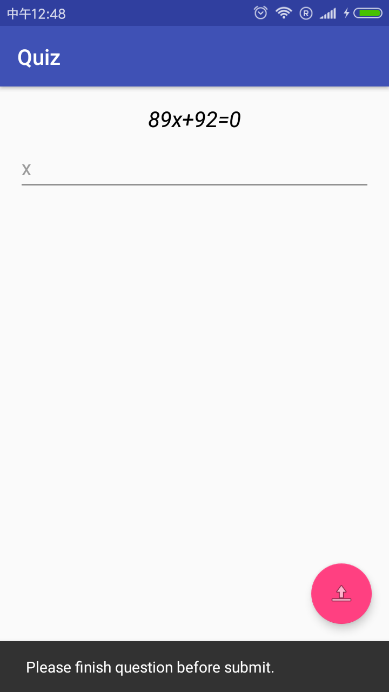

# 9.Summary
The summary page require the app to count time spent on each question. However,
it's a little bit quirky in my implementation, because **Quizer** allows user
to pass the question and answer it later. In order to counter this problem, I
add up all time spent on each fragment. The **OnPageChangeEvent** is listened.
The app would add time of duration between two change to the previous selected
question when the new page is selected.

    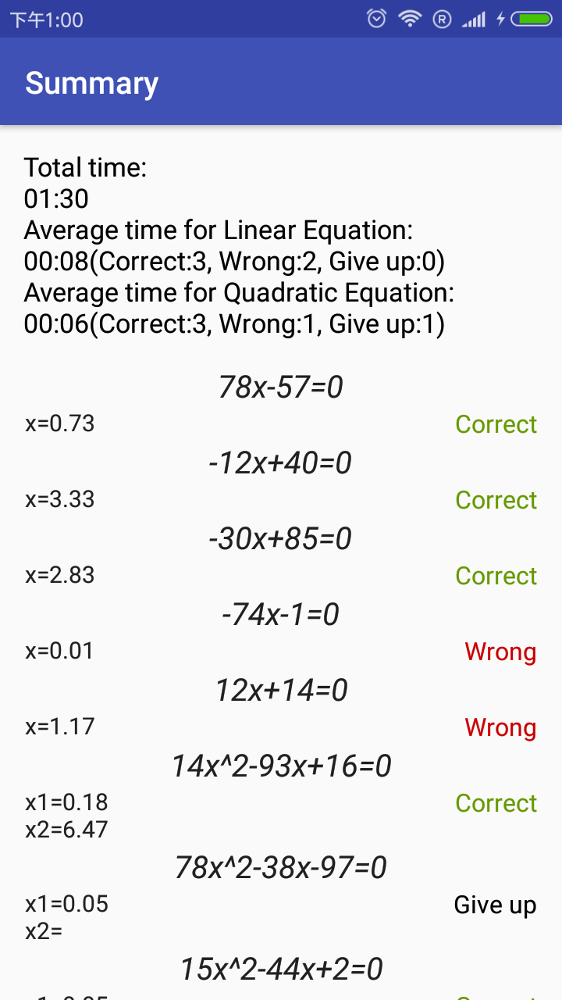

The **Summary Activity** display number of question which are correct, wrong, or 
given up respectively. The average time of each kind of question is also included.
A **RecyclerView** is introduced to display a detail information about questions.